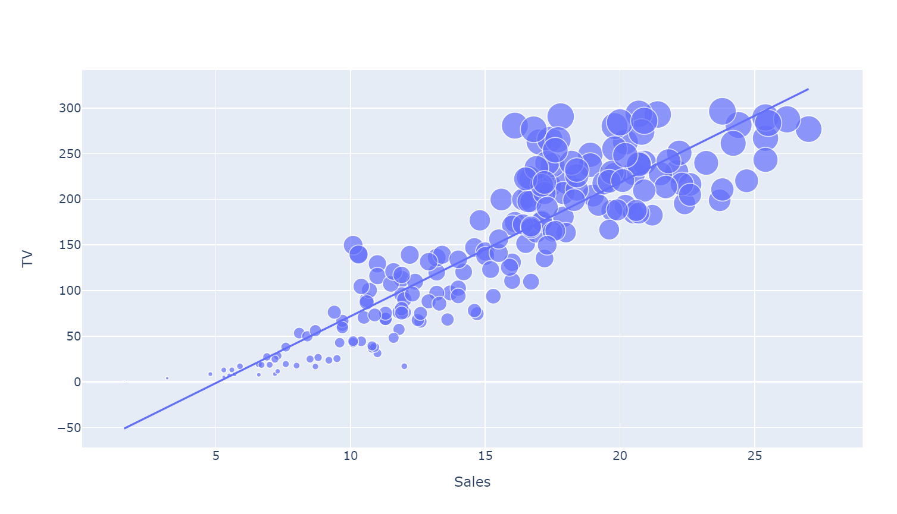
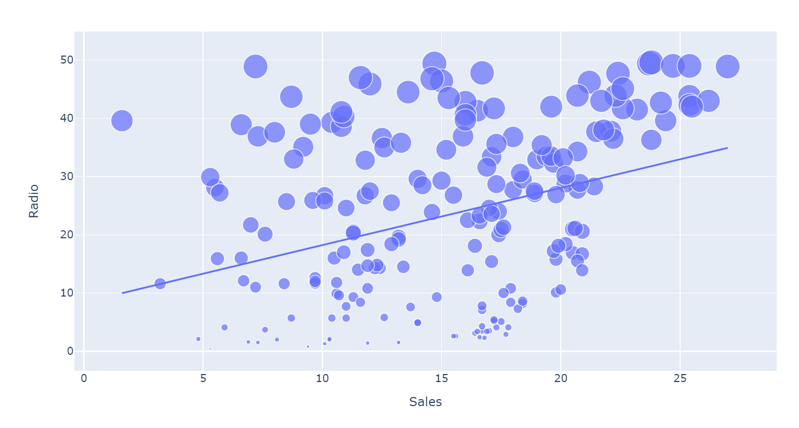
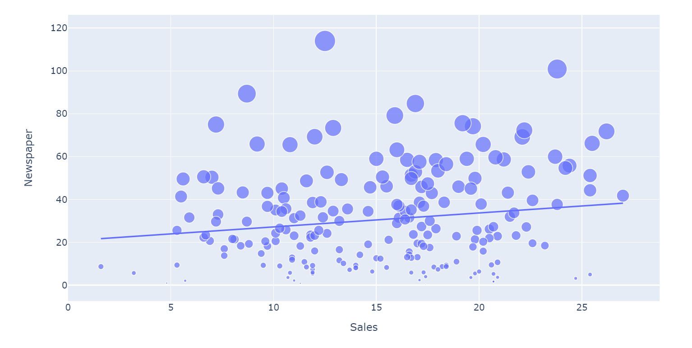
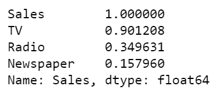
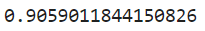

# Future Sales Prediction

## Purpose
Create a machine learning model to predict future sales based on amount spent on advertizing through various mediums.

Plotly was used to analyze data. LinearRegression was used to fit the model

## Results

#### TV Sales

- Most linear relationship
---
#### Radio Sales

---
#### Newspaper Sales

---
#### Correlation to Sales

---
#### Model Score

